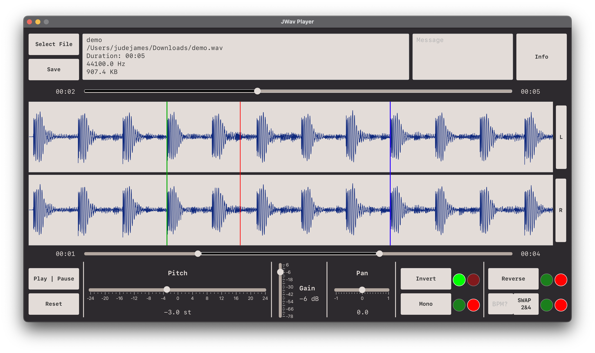
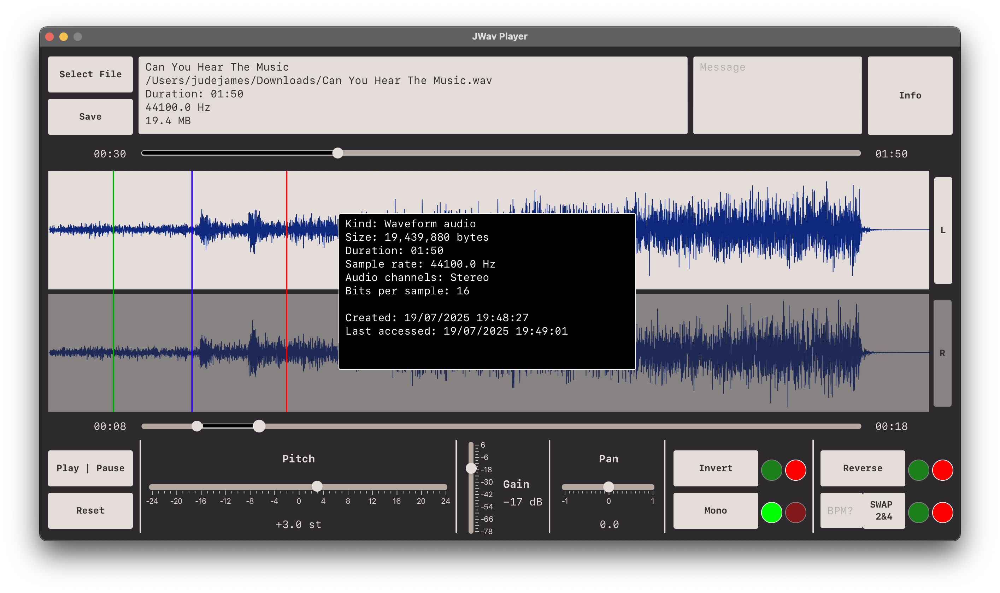

# JWav Player

## Overview

A unique WAV player, allowing you to load in any .wav file 
and play around with a number of playback options on the fly.

The standout feature is being able to swap beats 2&4 automatically — which I hadn't seen elsewhere. 
This leads to cool results, try it on your favourite songs!

## Features

Features:
- Load and play wav files
- View and scrub through waveform graph
- Shift pitch +- 2 octaves
- Convert stereo to mono
- Invert channels
- Pan and Gain control
- Trim start and end length
- Save changes to a new file

Fun features:
- Reverse song
- Automatically swap beats 2 & 4  
  (You must know the bpm of the song, use tunebat.com)

## How To Run

### Requirements

- Java JDK 22 (Java 17+ likely works)
- Maven 3.8+

```bash
# 1. Clone repo
git clone https://github.com/jude-james/JWav-Player.git

# 2. Change directory
cd JWav-Player

# 3. Run with maven
mvn clean javafx:run

# Or use included maven wrapper

# macOS/Linux
./mvnw clean javafx:run

# Windows
mvnw.cmd clean javafx:run
```

## Screenshots


